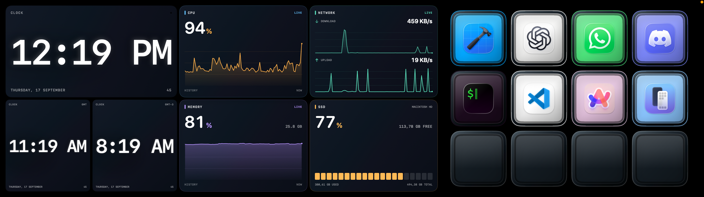
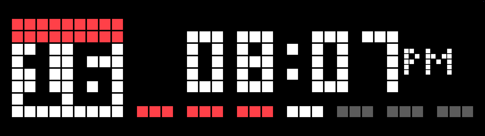
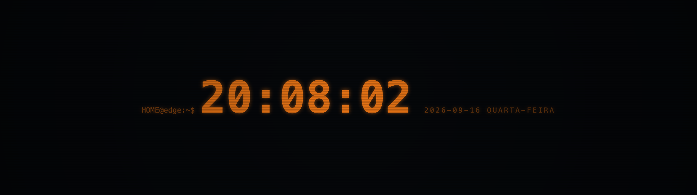

# EdgePanel


[](LICENSE)

EdgePanel is an independent macOS dashboard for the CORSAIR XENEON EDGE 14.5-inch display. It places a borderless, customizable panel on the XENEON and keeps the editor on your main display. It is built with SwiftUI and AppKit, works locally without an account, and stores settings in `~/Library/Application Support/EdgePanel`.

The project targets Apple Silicon and macOS 14 or later. Development and local testing have taken place on Apple Silicon with macOS 26; macOS 14 and a second Mac still need release validation. EdgePanel is not affiliated with or endorsed by CORSAIR or Elgato.

## Screenshots







## Features

- Pages, profiles, independent page colors or images, dark/light themes, and a layout editor with highlighted navigation, a responsive 16:4 preview, and a dedicated inspector. The editor preview uses static, title-only tiles; moving or resizing a widget still updates its position on the XENEON before the change is saved.
- Every profile has a fixed Desktop page at position 0. It hides the EdgePanel window on the XENEON, revealing the native macOS desktop and menu bar. It has no widgets and cannot be moved or deleted.
- Native clock, CPU, memory, network, SSD storage, application launcher, Action Deck, timer, web, Pixel Clock, and Pixel Dashboard widgets. The 2 × 2 application widget shows the selected app's icon with its name underneath, without a card or heading. Native widgets have per-instance appearance controls.
- Clock, CPU, memory, network, SSD, and timer cards can use a solid background color per widget. Leave the field empty or choose **Use default background** to keep the theme gradient. The application launcher stays transparent; Pixel Clock has its own background-color control. Web pages fill their widget without an EdgePanel title, border, or inset; a Web widget occupying the entire grid fills the display.
- The SSD widget reads the volume containing the current user's home directory and shows used, free, and total capacity. It refreshes about every 10 seconds, offers an optional used-space history graph, and labels unavailable capacity instead of inventing disk I/O, temperature, or health data. The disk-space API is declared in the app's privacy manifest for on-device display only.
- The native Clock and Pixel Clock can each use the Mac's time zone or any time zone in the system database. Search by city or region in the widget inspector; the selected zone is saved per widget.
- Pixel Clock uses square five-row digits and can show an optional calendar with the day cut out of its white face, plus seven groups of weekday blocks. Its inspector offers S/M/L/XL sizing, 12/24-hour time, seconds, AM/PM, week start and progress, text/accent/background colors, and background transparency. With 100% transparency it sits directly on the page image or color.
- Pixel Dashboard uses a responsive 76 × 16 LED-style matrix with text, weather, social, water, animation, clock, and timer tabs. Its editor tile shows its title and position; the dashboard gear opens in-place settings. Text supports rainbow/custom color, scaling or scrolling, and speed control. Weather and social values are entered manually and are labeled as such because no provider or account is connected. Existing Mac metrics and stopwatch modes remain available in the settings selector.
- Single-touch click and drag redirection to the explicitly selected XENEON display, with orientation controls and a calibration overlay.
- Physical brightness control through the bundled DDC/CI helper, with an explicit **Apply** action.
- Partial `.icuewidget` import and runtime support, including CPU and RAM sensors. Each imported instance has its own WKWebView and storage. Network access is disabled until the user allows a requested HTTPS domain.
- A menu-bar-only icon for opening the editor, switching profiles and pages, and quitting; EdgePanel stays out of the Dock. Optional launch at login.
- In-app update checks through Sparkle and signed GitHub Releases, once the release feed is published.

No Marketplace artwork or widget package is bundled. Pixel Clock and Pixel Dashboard are original widgets inspired by the [Pixel Clock](https://marketplace.elgato.com/product/pixel-clock-7268e1d1-43f5-4ae8-ac8d-2c59090a0a80) and [PIXEL//DASH XL](https://marketplace.elgato.com/product/pixeldash-xl-ce18bdb8-e63c-4fa0-95df-44ad530b1ccc) concepts. The native clock and performance widgets take visual inspiration from [Smoke Clock](https://marketplace.elgato.com/product/smoke-clock-c8bd2410-3619-49c4-8e1c-e5678c142269) and [Performance Grapher](https://marketplace.elgato.com/product/performance-grapher-48ceb9c8-0244-42e6-a7f1-21c9090a6d6d), without bundling their assets.

## Build and run

Install Xcode or the Apple Command Line Tools, accept the Xcode license, then run:

```sh
./scripts/build-app.sh
open dist/EdgePanel.app
```

The script builds an arm64 app and bundles the `m1ddc` helper and Sparkle. It requires a stable code-signing identity to preserve macOS privacy permissions across local rebuilds. Set `EDGE_LOCAL_SIGN_IDENTITY` to an existing Apple Development identity, or place its SHA-1 fingerprint in the ignored `.edgepanel-signing-identity` file. See [local signing and permissions](docs/UPDATES.md#local-builds-and-privacy-permissions). For a disposable build that will lose permissions after code changes, use `EDGE_ALLOW_ADHOC_SIGN=1 ./scripts/build-app.sh`. Use one stable app path, and quit any running EdgePanel before replacing it. Developer ID signing and notarization are required for a public download.

To run the tests:

```sh
swift test --disable-sandbox --scratch-path .build
```

On first launch, select the XENEON in the editor's **Display** section. Add widgets, drag them in the preview, and use the lower-right handle to resize. Select a widget for its controls, or click empty space in the preview to return to page settings. The UI follows the Mac's English or Portuguese language setting; this documentation uses the English labels.

Switch pages with **Control–Option–Up** (previous) or **Control–Option–Down** (next). EdgePanel registers these shortcuts with macOS so they work while another app is focused. This global registration does not require Input Monitoring. You can also use the page controls in the editor or choose a page from the menu-bar menu. Page content and its background animate in the chosen direction; navigation loops from the last page to the first and back within the current profile. If a different app or macOS reserves either combination, the editor reports that the global registration failed.

Every profile lists **Desktop** as page 0 in the editor's **Pages** section. Selecting it hides the XENEON dashboard window; use the same page shortcuts or EdgePanel's menu-bar menu to return to widgets. The editor shows an illustrative desktop placeholder rather than a live screen capture. The native menu bar follows your macOS display and auto-hide settings. Existing profiles gain this page automatically, and an existing Desktop page keeps its settings and ID when moved to position 0.

The XENEON dashboard has no page header. Regular pages use the full display height with a small outer margin; a single full-page iCUE, Pixel Clock, Pixel Dashboard, or Action Deck widget remains edge-to-edge.

Page backgrounds can use a color or an imported image. In **Page settings → Background image**, choose a PNG, JPEG, HEIC, WebP, GIF, or TIFF (up to 20 MB). **Fill** crops to cover the page, **Contain** shows the whole image, **Stretch** changes its aspect ratio, and **Original** uses its image size in macOS points. Horizontal and vertical controls place it at the left/center/right and top/center/bottom, respectively. The page color remains visible in uncovered areas. The preview uses the same placement as the dashboard.

For a Web widget, paste a URL into **Page URL** with ⌘V or use **Paste URL** beside the field. The app includes the standard Edit menu so cut, copy, paste, and select all work in editor text fields. On the dashboard, click a web form field to give that widget keyboard focus. Ordinary same-window redirects do not reset the widget to its configured URL.

## Action Deck

Add **Mini Action Deck** (2 × 2 cells, four keys) or **Compact Action Deck** (4 × 2 cells, eight keys) to a page with other widgets. **Full-page Action Deck** creates a 16 × 4 widget, adding a new page if the current page is occupied. Select the deck in the editor, then select a button in its grid. You can name each button, choose an SF Symbol or import a local image (up to 5 MB), use the selected app's icon, and choose its face color. **Use automatic color** restores the existing palette. Keys are square, with a raised frame and an image or symbol on the key face; imported images fill the face, with the selected color visible on the key trim. The grid supports 4–32 visible buttons, including a 15-button, 5-column layout. All keys fit inside the widget without internal scrolling; enlarge the widget if a dense grid makes its keys too small.

Actions can open an application or HTTP(S) URL, run a named macOS Shortcut, send one recorded keyboard shortcut or a sequence of recorded keystrokes, or switch to another page in the current profile. The editor lists installed Shortcuts when the `shortcuts` command can read them; you can also enter the name. Key recording uses the Mac's actual key codes, so it follows the user's keyboard layout. Press Esc to stop recording. The deck sends recorded keys to the last active non-EdgePanel app, which it activates before sending them. Keyboard actions require **Accessibility** permission; other deck actions do not. If no target app is available or an action fails, the dashboard shows a brief error.

Action Deck settings are stored in the local dashboard JSON. Imported button images are copied to `~/Library/Application Support/EdgePanel/ActionIcons`. The deck does not run shell commands or scripts directly; macOS Shortcuts are the automation path.

The Action Deck grid is transparent, so a page background image remains visible behind its buttons. Page images are copied to `~/Library/Application Support/EdgePanel/Backgrounds`; removing one from a page clears its selection but does not delete the imported file.

## Touch setup

The display needs both a video connection and its USB touch connection. Select the XENEON explicitly and turn on **Enable touch**. macOS must grant EdgePanel **Input Monitoring** to capture the touch controller and **Accessibility** to post the redirected click and drag events. These permissions are managed in **System Settings → Privacy & Security**.

If the editor says **“macOS is still handling touch”**, open **Input Monitoring** from its warning, enable EdgePanel, return to the app, and click **Check again**. Until the controller is captured, touching the XENEON may still click on the display currently in focus. If the grant does not take effect, quit and reopen the installed app. Use **Calibrate touch** to check the center and corners, and adjust **Swap axes**, **Invert horizontal**, or **Invert vertical** if needed.

Run only one touch driver for this controller at a time. EdgePanel targets the saved Corsair display identity and never substitutes another monitor if that display disappears. With a captured controller but missing Accessibility permission, it discards touch reports rather than posting them elsewhere. Only one XENEON and one contact are supported; multitouch gestures are not implemented. See the [hardware test checklist](docs/HARDWARE_TESTS.md) for scenarios that still require physical validation.

## Brightness

The **Hardware brightness** control reads the selected XENEON through DDC/CI. Moving the slider previews a value; **Apply** sends it to the display. The video cable or dock must pass DDC/CI commands. If the display is absent, ambiguous, or does not answer DDC, the control reports an error and does not target another monitor. The helper is based on MIT-licensed [m1ddc](https://github.com/waydabber/m1ddc); DisplayBuddy is not required.

## iCUE widget compatibility

Use **iCUE library → Import .icuewidget**, or open an `.icuewidget` file in Finder with **Open With → EdgePanel**. The importer checks the ZIP structure, manifest, required files, checksums, paths, symlinks, and size limits before installing a package. Unsupported dependencies are shown before activation.

| Capability | Status |
| --- | --- |
| Local HTML, CSS, JavaScript, and assets | Supported in a separate WKWebView per widget instance |
| iCUE initialization, IDs, configurable properties, and callbacks | Partial implementation |
| Color, text, switch, slider, list, tabs, and sensor selection | Supported controls |
| Sensors Data Provider 1.0 | Real Mac CPU and RAM usage only |
| Translations and per-instance local storage | Supported subset |
| Network requests | Only requested HTTPS domains individually enabled by the user |
| GPU, temperature, fan, and firmware sensors | Unsupported; values are never fabricated |
| Media, Stream Deck, Windows notifications, binary plugins, full iCUE profiles | Unsupported |

iCUE's official widget runtime uses Chromium, while EdgePanel uses WKWebView. A package that imports successfully can therefore render or behave differently. Imported JavaScript has no bridge to the shell, arbitrary files, or touch control. Imported packages retain their authors' licenses and are not part of this repository.

## Contributing and release status

Read [CONTRIBUTING.md](CONTRIBUTING.md) before sending a change. [docs/VALIDATION.md](docs/VALIDATION.md) records what has been checked locally and what remains unverified. In particular, physical touch after granting Input Monitoring, macOS 14, and installation on a second Mac still require testing.

The menu-bar icon has **Check for Updates…**. The [update and release guide](docs/UPDATES.md) explains the GitHub Releases feed, signing key, and publishing order. Version 0.8.4 is the first build containing Sparkle; the feed has not yet been published, so existing 0.8.3 installations need one manual replacement. `scripts/release-dmg.sh` prepares a Developer ID signed, hardened, notarized DMG when a publisher supplies signing credentials. Do not put credentials in the repository. The release script has not been exercised with a Developer ID certificate; a public release should complete the [hardware and clean-install checklist](docs/HARDWARE_TESTS.md) first.

EdgePanel is available under the [MIT License](LICENSE). See [third-party notices](THIRD_PARTY_NOTICES.md) for the touch reference project and bundled DDC and Sparkle components.
